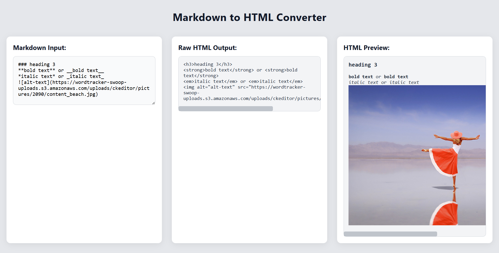

# Markdown to HTML Converter(FreeCodeCamp customized project)

A simple web application that converts Markdown input into HTML in real-time.  
Supports headings, bold, italic, links, images, and blockquotes.

Test: https://nima-shafiei.github.io/Markdown-to-HTML-converter
---

## Features
- ✨ Convert headings (H1, H2, H3)
- **Bold** and *italic* text
- ✅ Links and images support
- 💬 Blockquotes
- 👀 Live preview of HTML
- 📱 Responsive design

---

## Screenshot

---
